***HỆ THỐNG LƯU TRỮ DỰ ÁN***

NHÓM 13

Table of Contents

[1. Giới thiệu tổng quan về tài liệu
[5](#giới-thiệu-tổng-quan-về-tài-liệu)](#giới-thiệu-tổng-quan-về-tài-liệu)

[1.1 Mục đích của tài liệu
[5](#mục-đích-của-tài-liệu)](#mục-đích-của-tài-liệu)

[1.2 Phạm vi của tài liệu [5](#_Toc112621453)](#_Toc112621453)

[1.3 Từ ngữ viết tắt [5](#_Toc112621454)](#_Toc112621454)

[1.4 Tài liệu tham khảo [5](#_Toc112621455)](#_Toc112621455)

[2. Tổng quan hệ thống và đặc tả chức năng
[5](#tổng-quan-hệ-thống-và-đặc-tả-chức-năng)](#tổng-quan-hệ-thống-và-đặc-tả-chức-năng)

[2.1 Tổng quan hệ thống [5](#tổng-quan-hệ-thống)](#tổng-quan-hệ-thống)

[2.1.1 Mổ tả hệ thống [5](#mổ-tả-hệ-thống)](#mổ-tả-hệ-thống)

[2.2 Yêu cầu người dùng [7](#yêu-cầu-người-dùng)](#yêu-cầu-người-dùng)

[2.2.1 Chức năng [7](#chức-năng)](#chức-năng)

[2.2.2 Giao diện [7](#giao-diện)](#giao-diện)

[2.2.3 Phần cứng và phần mềm Hệ thống
[7](#phần-cứng-và-phần-mềm-hệ-thống)](#phần-cứng-và-phần-mềm-hệ-thống)

[2.3 Đặc tả người dùng [8](#đặc-tả-người-dùng)](#đặc-tả-người-dùng)

[2.4 Xây dựng một số trang chính và chức năng của trang
[8](#xây-dựng-một-số-trang-chính-và-chức-năng-của-trang)](#xây-dựng-một-số-trang-chính-và-chức-năng-của-trang)

[2.4.1 Màn hình đăng nhập [8](#màn-hình-đăng-nhập)](#màn-hình-đăng-nhập)

[2.4.2 Màn hình chính [8](#màn-hình-chính)](#màn-hình-chính)

[2.4.3 Màn hình dự án [8](#màn-hình-dự-án)](#màn-hình-dự-án)

[2.4.4 Màn hình cấu trúc công ty
[9](#màn-hình-cấu-trúc-công-ty)](#màn-hình-cấu-trúc-công-ty)

[2.4.5 Màn hình thông tin cá nhân
[9](#màn-hình-thông-tin-cá-nhân)](#màn-hình-thông-tin-cá-nhân)

[3. Mô hình hóa hệ thống
[10](#mô-hình-hóa-hệ-thống)](#mô-hình-hóa-hệ-thống)

[3.1 Biểu đồ phân cấp chức năng
[10](#biểu-đồ-phân-cấp-chức-năng)](#biểu-đồ-phân-cấp-chức-năng)

[3.2 Screen workflow [11](#screen-workflow)](#screen-workflow)

[3.3 Data workflow: [12](#user-flow)](#user-flow)

[3.4 Hệ thống phân quyền
[16](#hệ-thống-phân-quyền)](#hệ-thống-phân-quyền)

[3.5 Yêu cầu phi chức năng
[17](#yêu-cầu-phi-chức-năng)](#yêu-cầu-phi-chức-năng)

[3.5.1 Tính bảo mật [17](#tính-bảo-mật)](#tính-bảo-mật)

[3.5.2 Tính sẵn sàng và khả năng đáp ứng
[18](#tính-sẵn-sàng-và-khả-năng-đáp-ứng)](#tính-sẵn-sàng-và-khả-năng-đáp-ứng)

[3.5.3 Giao diện [18](#giao-diện-1)](#giao-diện-1)

[3.5.4 Khả năng sử dụng [18](#khả-năng-sử-dụng)](#khả-năng-sử-dụng)

[3.5.5 Hiệu suất [18](#hiệu-suất)](#hiệu-suất)

[3.5.6 Ràng buộc thiết kế
[18](#ràng-buộc-thiết-kế)](#ràng-buộc-thiết-kế)

Tài liệu đặc tả yêu cầu

# Giới thiệu tổng quan về tài liệu

## Mục đích của tài liệu

Mục đích của tài liệu này là trình bày mô tả chi tiết về Hệ thống lưu
trữ dự án của công ty X. Nó giải thích mục đích và cung cấp sơ đồ tính
năng của hệ thống, giao diện, cách thức hoạt động, các ràng buộc mà nó
cần có và cách xử lý các kích thích từ bên ngoài.

## Từ ngữ viết tắt

> Cung cấp tổng quan về bất kỳ định nghĩa nào mà người đọc nên hiểu
> trước khi đọc tiếp.

|                 |                 |
|-----------------|-----------------|
| Group           | Nhóm            |
| Screen workflow | Sơ đồ trang web |
| Data workflow   | Sơ đồ ngữ cảnh  |
| Use case        | Ca sử dụng      |

# Tổng quan hệ thống và đặc tả chức năng

Tài liệu chứa quan điểm chi tiết về sản phẩm từ các bên liên quan khác
nhau. Nó cung cấp các chức năng sản phẩm chi tiết của Hệ thống Web quản
lý dự án với các đặc điểm người dùng được phép, các ràng buộc, giả định
và phụ thuộc và các tập con yêu cầu.

## Tổng quan hệ thống

### Mổ tả hệ thống

Hệ thống gồm 2 hoạt động chính:

- Hoạt động của Quản lý

- Hoạt động của Thành viên

Chức năng website:

<table style="width:89%;">
<colgroup>
<col style="width: 45%" />
<col style="width: 43%" />
</colgroup>
<thead>
<tr>
<th style="text-align: center;">Quản lý</th>
<th style="text-align: center;">Thành viên</th>
</tr>
</thead>
<tbody>
<tr>
<td>Đăng nhập, đăng xuất</td>
<td>Đăng nhập, đăng xuất</td>
</tr>
<tr>
<td>
Cập nhập thông tin cá nhân:

<ul>
<li>
Thay đổi mật khẩu
</li>
<li>
Cập nhập thông tin
</li>
</ul></td>
<td>
Cập nhập thông tin cá nhân:

<ul>
<li>
Thay đổi mật khẩu
</li>
<li>
Cập nhập thông tin
</li>
</ul></td>
</tr>
<tr>
<td>
Quản lý tác vụ:

<ul>
<li>
Thêm
</li>
<li>
Cập nhập
</li>
<li>
Kết thúc
</li>
</ul></td>
<td>
Quản lý tác vụ:

<ul>
<li>
Thêm
</li>
<li>
Cập nhập
</li>
<li>
Kết thúc
</li>
</ul></td>
</tr>
<tr>
<td>
Quản lý dự án:

<ul>
<li>
Thêm thành viên
</li>
<li>
Cập nhập tác vụ
</li>
</ul></td>
<td></td>
</tr>
<tr>
<td>
Quản lý phòng ban:

<ul>
<li>
Cập nhập phòng ban
</li>
<li>
Cập nhập nhân viên
</li>
</ul></td>
<td></td>
</tr>
<tr>
<td>
Quản lý nhân viên:

<ul>
<li>
Thêm
</li>
<li>
Cập nhập
</li>
<li>
Xóa
</li>
</ul></td>
<td></td>
</tr>
</tbody>
</table>

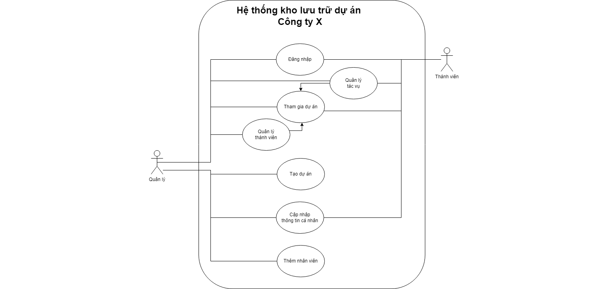

**Hình 1 Mô hình tổng quan của hệ thống**

## Yêu cầu người dùng

### Chức năng 

### Giao diện

Tài liệu Mockup sẽ được cập nhập sau.

### Phần cứng và phần mềm Hệ thống

> Máy tính cần kết nối Internet
>
> Hệ thống cơ sở dữ liệu: SSMS- SQL
>
> Tính bảo mật cao

## Đặc tả người dùng

Gồm 2 người dùng chính:

- Thành viên: người dùng cấp thấp, chức năng căn bản.

- Quản lý: người dùng bậc cao.

## Xây dựng một số trang chính và chức năng của trang

### Màn hình đăng nhập

- Mục đích: Kết nối người dùng vào hệ thống. Không tự động đăng nhập
  hoặc lưu thông tin tài khoản. Nếu người dùng là cấp quản lý, đăng nhập
  vào hệ thống quản lý. Nếu người dùng là cấp thành viên, đăng nhập vào
  hệ thống thành viên.

- Quên mật khẩu: khi click vào sẽ yêu cầu nhập mail công ty và gửi mật
  khẩu cũ đến địa chỉ mail đó.

- Email

- Password

- Reset: xóa toàn bộ thông tin đang nhập

- Login: tiến hành đăng nhập

### Màn hình chính

- Mục đích: Hiển thị danh sách thông tin dự án cá nhân

- Chức năng tìm kiếm:

  - Nhập tên người dùng hoặc tên dự án

- Bảng danh sách dự án cá nhân:

  - Dự án đang tham gia

  - Thông tin cơ bản đính kèm

- Hệ thống menu:

  - Menu bên trái: Tác vụ và dự án, Công ty, Thông tin cá nhân, Log out

### Màn hình dự án

- Mục đích: theo dõi dự án, quản lý dự án và thành viên

- Chức năng tác vụ:

  - Tạo tác vụ mới

  - Danh sách tác vụ trong dự án

- Giới thiệu dự án: thông tin dự án và thành viên

- Chức năng tìm kiếm:

  - Tìm kiếm thành viên

  - Tìm kiếm tác vụ

  - Tìm kiếm tài liệu

- Hệ thống menu:

  - Menu bên trái: Tác vụ và dự án, Công ty, Thông tin cá nhân, Log out

### Màn hình cấu trúc công ty

- Mục đích: sơ đồ tổ chức và thành viên

- Hệ thống menu:

  - Menu bên trái: Tác vụ và dự án, Công ty, Thông tin cá nhân, Log out

  - Menu tác vụ: cấu trúc công ty, nhân viên

- Chức năng tìm kiếm:

  - Nhập tên người dùng hoặc tên dự án

- Thẻ cấu trúc công ty:

  - Sơ đồ phòng ban

- Thẻ nhân viên:

  - Danh sách nhân viên

  - Thêm nhân viên

### Màn hình thông tin cá nhân

- Mục đích: hiển thị hồ sơ nhân viên

- Ảnh đại diện - chức vụ

- Thẻ thông tin:

  - Thông tin liên lạc chi tiết

  - Giới thiệu bản thân

  - Thay đổi mật khẩu

- Thẻ tác vụ:

  - Danh sách tác vụ cá nhân

# Mô hình hóa hệ thống

## Biểu đồ phân cấp chức năng

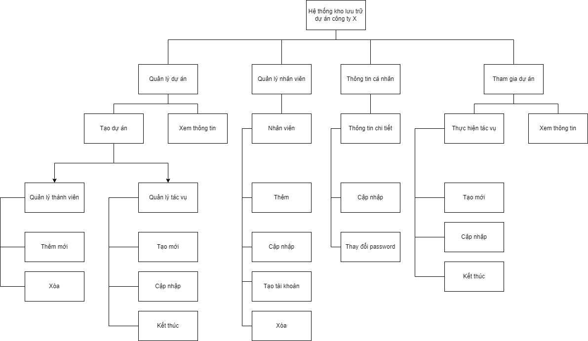

**Hình 2: Biểu đồ chức năng**

## Screen workflow

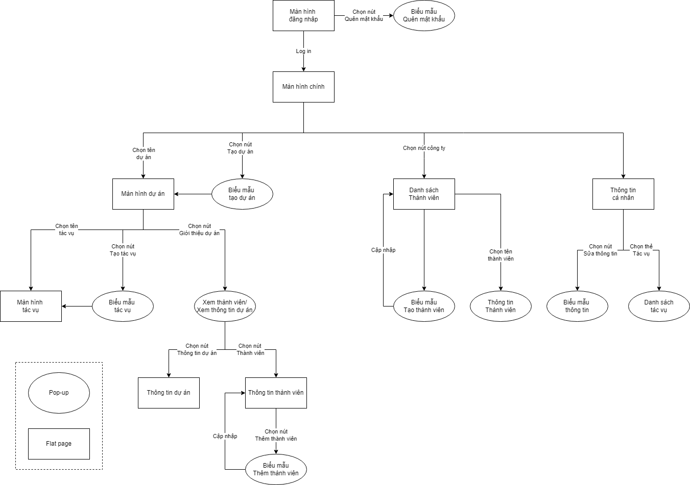

**Hình 3 Screen workflow**

## User flow:

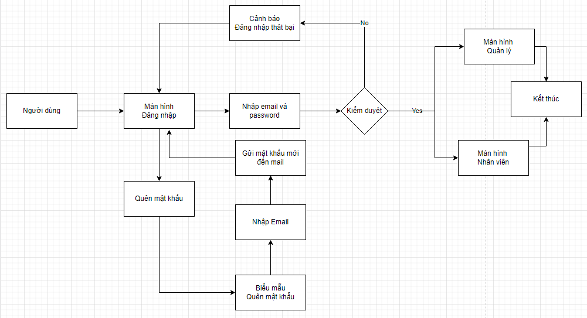

<table style="width:98%;">
<colgroup>
<col style="width: 21%" />
<col style="width: 76%" />
</colgroup>
<tbody>
<tr>
<td><strong>Use Case Name</strong></td>
<td>Đăng nhập</td>
</tr>
<tr>
<td><strong>Điều kiện</strong></td>
<td>
Tài khoản đã tồn tại trong hệ thống

Thiết bị của người dùng đã được kết nối internet khi thực hiện đăng
nhập
</td>
</tr>
<tr>
<td><strong>Luồng chính</strong></td>
<td><ol type="1">
<li>
Người dùng truy cập Hệ thống
</li>
<li>
Người dùng nhập mail và mật khẩu vào màn hình Đăng nhập
</li>
<li>
Hệ thống kiểm tra thông tin
</li>
<li>
Thông tin đúng, hệ thống cho phép truy cập. Nếu tài khoản là Quản
lý, hệ thống đăng nhập vào Màn hình quản lý. Nếu tài khoản là Nhân viên,
hệ thống đăng nhập vào Màn hình nhân viên.
</li>
</ol></td>
</tr>
<tr>
<td><strong>Luồng phụ 1</strong></td>
<td style="text-align: left;">
Nếu đăng nhập thất bại, hệ thống hiển
thị Cảnh báo và quay lại màn hình đăng nhập. Người dùng chọn nhập lại
thông tin hoặc Quên mật khẩu.

Nếu người dùng chọn đăng nhập lại, hệ thống quay lại luồng
chính.
</td>
</tr>
<tr>
<td><strong>Luồng phụ 2</strong></td>
<td style="text-align: left;">
2. Người dùng chọn Quên mật khẩu, hệ
thống hiển thị Biểu mẫu Quên mật khẩu.

3. Người dùng điền mail

4. Hệ thống gửi mật khẩu mới tới mail đã điền

5. Người dùng quay lại luồng chính.
</td>
</tr>
</tbody>
</table>

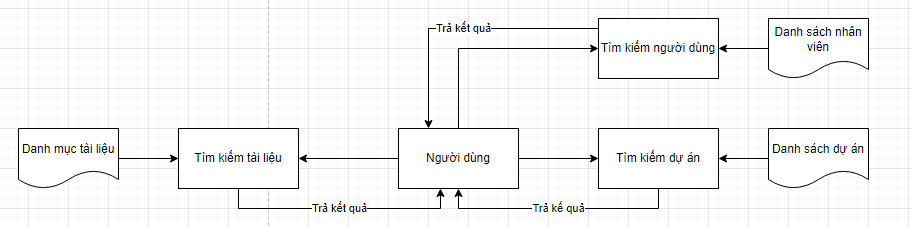

<table style="width:98%;">
<colgroup>
<col style="width: 21%" />
<col style="width: 76%" />
</colgroup>
<tbody>
<tr>
<td><strong>Use Case Name</strong></td>
<td>Tìm kiếm Dự án/Người dùng/Tài liệu</td>
</tr>
<tr>
<td><strong>Điều kiện</strong></td>
<td>
Dự án/Người dùng/Tài liệu đã tồn tại trong hệ thống

Người dùng đăng nhập ứng dụng thành công
</td>
</tr>
<tr>
<td><strong>Luồng chính</strong></td>
<td><ol type="1">
<li>
Người dùng sử dụng thanh tìm kiếm đầu trang.
</li>
<li>
Hệ thống sẽ xuất một danh sách theo thứ tự mặc định.
</li>
<li>
Người dùng click chọn một tên.
</li>
<li></li>
</ol></td>
</tr>
<tr>
<td><strong>Luồng phụ 1</strong></td>
<td style="text-align: left;">Ở bước 2, nếu thông tin sai, hệ thống sẽ
không hiển thị bất kì thông tin gì.</td>
</tr>
</tbody>
</table>

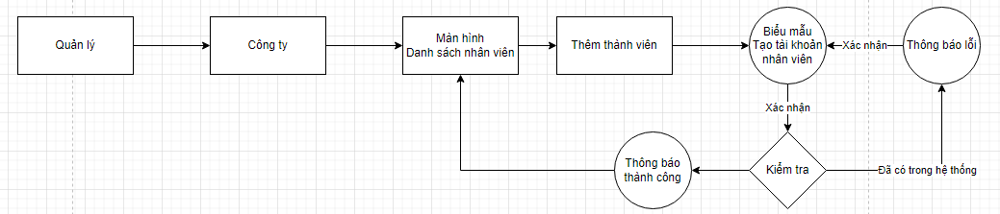

<table style="width:97%;">
<colgroup>
<col style="width: 21%" />
<col style="width: 75%" />
</colgroup>
<thead>
<tr>
<th><strong>Use Case Name</strong></th>
<th>Thêm nhân viên mới</th>
</tr>
</thead>
<tbody>
<tr>
<td><strong>Điều kiện</strong></td>
<td>Quản lý đăng nhập ứng dụng thành công</td>
</tr>
<tr>
<td><strong>Luồng chính</strong></td>
<td><ol type="1">
<li>
Quản lý mở màn hình Cấu trúc công ty,
</li>
<li>
Tại thẻ cấu trúc công ty hoặc thẻ Nhân viên, chọn Thêm nhân
viên
</li>
<li>
Hệ thống hiển thị Biểu mẫu Tạo tài khoản nhân viên mới
</li>
<li>
Quản lý điền thông tin, chọn xác nhận
</li>
<li>
Hệ thống kiểm tra, lưu thông tin và thoát biểu mẫu
</li>
</ol></td>
</tr>
<tr>
<td><strong>Luồng phụ</strong></td>
<td style="text-align: left;">Ở bước 4, nếu không muốn lưu, chọn Hủy bỏ,
hệ thống thoát biểu mẫu</td>
</tr>
</tbody>
</table>

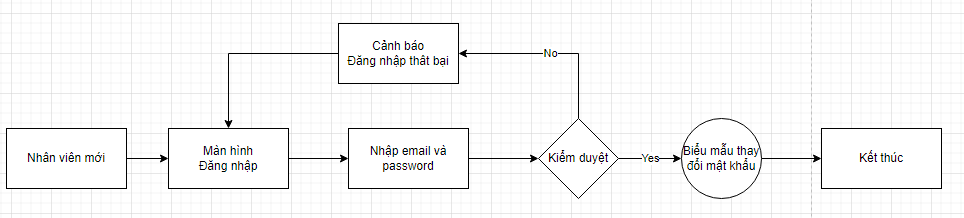

<table style="width:97%;">
<colgroup>
<col style="width: 21%" />
<col style="width: 75%" />
</colgroup>
<thead>
<tr>
<th><strong>Use Case Name</strong></th>
<th>Nhân viên mới đăng nhập lần đầu</th>
</tr>
</thead>
<tbody>
<tr>
<td><strong>Điều kiện</strong></td>
<td>
Quản lý đã tạo tài khoản mới thành công

Nhân viên mới nhận được email thông báo tài khoản và mật
khẩu
</td>
</tr>
<tr>
<td><strong>Luồng chính</strong></td>
<td><ol type="1">
<li>
Nhân viên truy cập vào hệ thống
</li>
<li>
Tại màn hình đăng nhập, nhân viên mới nhập tài khoản được
cấp
</li>
<li>
Hệ thống kiểm duyệt
</li>
<li>
Thông tin đúng, hệ thống yêu cầu thay đổi mật khẩu mới
</li>
<li>
Hệ thống cho phép truy cập
</li>
</ol></td>
</tr>
<tr>
<td><strong>Luồng phụ</strong></td>
<td style="text-align: left;">Ở bước 3, nếu thông tin sai quay lại bước
2.</td>
</tr>
</tbody>
</table>

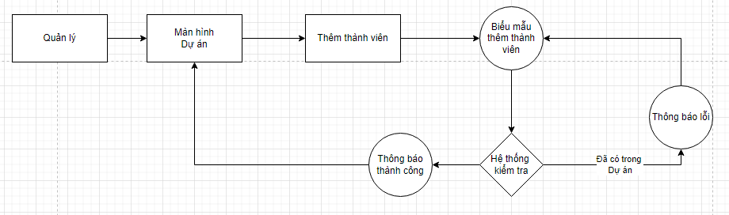

<table style="width:98%;">
<colgroup>
<col style="width: 21%" />
<col style="width: 76%" />
</colgroup>
<tbody>
<tr>
<td><strong>Use Case Name</strong></td>
<td>Thêm thành viên cho dự án</td>
</tr>
<tr>
<td><strong>Điều kiện</strong></td>
<td>
Dự án đã tồn tại trong hệ thống

Nhân viên đã có tài khoản trên hệ thống

Quản lý đăng nhập ứng dụng thành công
</td>
</tr>
<tr>
<td><strong>Luồng chính</strong></td>
<td><ol type="1">
<li>
Quản lý mở giao diện dự án, chọn nút Giới thiệu dự án, chọn nút
Thành viên.
</li>
<li>
Hệ thống hiển thị danh sách thành viên theo thứ tự mặc
định.
</li>
<li>
Quản lý chọn Thêm thành viên.
</li>
<li>
Hệ thống hiển thị Biểu mẫu thêm thành viên.
</li>
<li>
Quản lý điền và xác nhận
</li>
<li>
Hệ thống gửi thông báo cho thành viên và trở lại màn hình Danh
sách thành viên.
</li>
</ol></td>
</tr>
<tr>
<td><strong>Luồng phụ 1</strong></td>
<td style="text-align: left;">Ở bước 5, nếu thành viên đã thuộc dự án,
hệ thống sẽ hiển thị thông báo. Quản lý chọn Hủy bỏ để thoát.</td>
</tr>
<tr>
<td><strong>Luồng phụ 2</strong></td>
<td style="text-align: left;">Ở bước 5, nếu quản lý không muốn lưu chọn
Hủy bỏ, hệ thống trở lại màn hình Danh sách thành viên.</td>
</tr>
</tbody>
</table>

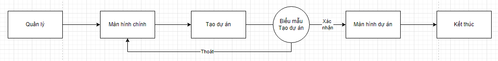

<table style="width:98%;">
<colgroup>
<col style="width: 21%" />
<col style="width: 76%" />
</colgroup>
<tbody>
<tr>
<td><strong>Use Case Name</strong></td>
<td>Tạo dự án</td>
</tr>
<tr>
<td><strong>Điều kiện</strong></td>
<td>Quản lý đăng nhập ứng dụng thành công</td>
</tr>
<tr>
<td><strong>Luồng chính</strong></td>
<td><ol type="1">
<li>
Quản lý truy cập vào hệ thống, chọn nút Tạo Dự án trên trang Danh
sách dự án.
</li>
<li>
Hệ thống hiển thị Biểu mẫu tạo Dự án, Quản lý điền thông
tin
</li>
<li>
Hệ thống xác nhận thông tin và mở giao diện Dự án vừa
tạo.
</li>
</ol></td>
</tr>
<tr>
<td><strong>Luồng phụ</strong></td>
<td style="text-align: left;">Ở bước 3, nếu quản lý không muốn thay đổi
được lưu, Quản lý chọn nút Thoát, hệ thống sẽ đóng biểu mẫu và không lưu
các thay đổi mới. Hệ thống hiển thị Màn hình chính.</td>
</tr>
</tbody>
</table>

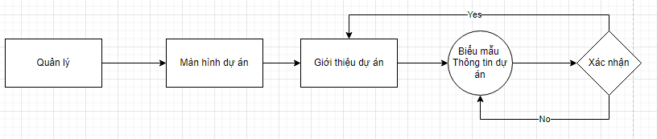

<table style="width:98%;">
<colgroup>
<col style="width: 21%" />
<col style="width: 76%" />
</colgroup>
<tbody>
<tr>
<td><strong>Use Case Name</strong></td>
<td>Chỉnh sửa thông tin dự án</td>
</tr>
<tr>
<td><strong>Điều kiện</strong></td>
<td>
Dự án đã có trên hệ thống

Dự án thuộc quyền của quản lý
</td>
</tr>
<tr>
<td><strong>Luồng chính</strong></td>
<td><ol type="1">
<li>
Quản lý truy cập vào hệ thống, chọn nút Giới thiệu dự án trên Màn
hình dự án.
</li>
<li>
Hệ thống hiển thị Biểu mẫu thông tin, Quản lý thực hiện chỉnh
sửa
</li>
<li>
Hệ thống xác nhận thông tin và trở lại trang thông tin dự
án.
</li>
</ol></td>
</tr>
<tr>
<td><strong>Luồng phụ</strong></td>
<td style="text-align: left;">Ở bước 3, nếu quản lý không muốn thay đổi
được lưu, Quản lý chọn nút Thoát, hệ thống sẽ đóng biểu mẫu và không lưu
các thay đổi mới.</td>
</tr>
</tbody>
</table>

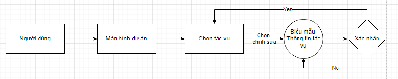

<table style="width:98%;">
<colgroup>
<col style="width: 21%" />
<col style="width: 76%" />
</colgroup>
<tbody>
<tr>
<td><strong>Use Case Name</strong></td>
<td>Chỉnh sửa tác vụ</td>
</tr>
<tr>
<td><strong>Điều kiện</strong></td>
<td>
Dự án đã có trên hệ thống

Tác vụ thuộc được tạo bởi người dùng hoặc do quản lý chỉnh
sửa
</td>
</tr>
<tr>
<td><strong>Luồng chính</strong></td>
<td><ol type="1">
<li>
Người dùng truy cập vào Màn hình dự án.
</li>
<li>
Người dùng chọn tác vụ, chọn chỉnh sửa
</li>
<li>
Hệ thống hiển thị Biểu mẫu Thông tin tác vụ, người dùng thực hiện
chỉnh sửa
</li>
<li>
Hệ thống xác nhận thông tin và trở lại trang thông tin tác
vụ.
</li>
</ol></td>
</tr>
<tr>
<td><strong>Luồng phụ</strong></td>
<td style="text-align: left;">Ở bước 3, nếu người dùng không muốn thay
đổi được lưu, người dùng chọn nút Thoát, hệ thống sẽ đóng biểu mẫu và
không lưu các thay đổi mới.</td>
</tr>
</tbody>
</table>

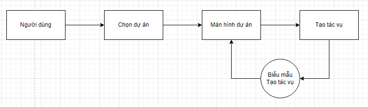

<table style="width:98%;">
<colgroup>
<col style="width: 21%" />
<col style="width: 76%" />
</colgroup>
<tbody>
<tr>
<td><strong>Use Case Name</strong></td>
<td>Tạo tác vụ</td>
</tr>
<tr>
<td><strong>Điều kiện</strong></td>
<td>
Dự án đã tồn tại trong hệ thống

Quản lý và Thành viên đã đăng nhập ứng dụng thành công

Chỉ Quản lý và Thành viên được cấp quyền được mở dự án
</td>
</tr>
<tr>
<td><strong>Luồng chính</strong></td>
<td><ol type="1">
<li>
Người dùng chọn dự án.
</li>
<li>
Hệ thống hiển thị Màn hình dự án
</li>
<li>
Người dùng chọn Tạo tác vụ.
</li>
<li>
Hệ thống hiển thị Biểu mẫu Tạo tác vụ
</li>
<li>
Người dùng nhập thông tin và chọn Thêm công việc
</li>
<li>
Hệ thống đóng biểu mẫu, tác vụ xuất hiện trên Danh sách
</li>
</ol></td>
</tr>
<tr>
<td><strong>Luồng phụ 1</strong></td>
<td style="text-align: left;">Ở bước 5, nếu chọn Hủy bỏ, hệ thống trở
lại màn hình dự án</td>
</tr>
</tbody>
</table>

## Hệ thống phân quyền

X: Được phân quyền

<table style="width:74%;">
<colgroup>
<col style="width: 51%" />
<col style="width: 11%" />
<col style="width: 11%" />
</colgroup>
<tbody>
<tr>
<td style="text-align: center;"><strong>Nội dung</strong></td>
<td style="text-align: center;"><strong>Quản lý</strong></td>
<td style="text-align: center;"><strong>Thành viên</strong></td>
</tr>
<tr>
<td style="text-align: center;">Chỉnh sửa Biểu mẫu thay đổi mật
khẩu</td>
<td style="text-align: center;">X</td>
<td style="text-align: center;"></td>
</tr>
<tr>
<td style="text-align: center;">Chỉnh sửa Biểu mẫu Tạo dự án</td>
<td style="text-align: center;">X</td>
<td style="text-align: center;"></td>
</tr>
<tr>
<td style="text-align: center;">Chỉnh sửa Biểu mẫu Tạo tác vụ</td>
<td style="text-align: center;">X</td>
<td style="text-align: center;"></td>
</tr>
<tr>
<td style="text-align: center;">
Chỉnh sửa thông tin chung của Dự
án

<em>Chỉnh sửa tên, người quản lý,…</em>
</td>
<td style="text-align: center;">X</td>
<td style="text-align: center;"></td>
</tr>
<tr>
<td style="text-align: center;">
Đánh dấu trạng thái Dự án

<em>Tình trạng đóng-mở của Dự án</em>
</td>
<td style="text-align: center;">X</td>
<td style="text-align: center;"></td>
</tr>
<tr>
<td style="text-align: center;">
Chỉnh sửa deadline

<em>Thay đổi thời gian kết thúc Dự án</em>
</td>
<td style="text-align: center;">X</td>
<td style="text-align: center;"></td>
</tr>
<tr>
<td style="text-align: center;">
Chỉnh sửa thông tin chung của Tác
vụ

<em>Chỉnh sửa tên, người quản lý,…</em>
</td>
<td style="text-align: center;">X</td>
<td style="text-align: center;">X</td>
</tr>
<tr>
<td style="text-align: center;">
Đánh dấu trạng thái Tác vụ

<em>Tình trạng đóng-mở</em>
</td>
<td style="text-align: center;">X</td>
<td style="text-align: center;">X</td>
</tr>
<tr>
<td style="text-align: center;">
Chỉnh sửa deadline Tác vụ

<em>Thay đổi thời gian kết thúc</em>
</td>
<td style="text-align: center;">X</td>
<td style="text-align: center;">X</td>
</tr>
<tr>
<td style="text-align: center;">Xóa dự án</td>
<td style="text-align: center;">X</td>
<td style="text-align: center;"></td>
</tr>
<tr>
<td style="text-align: center;">Chỉnh sửa biểu mẫu Thêm thành viên</td>
<td style="text-align: center;">X</td>
<td style="text-align: center;"></td>
</tr>
<tr>
<td style="text-align: center;">Chỉn sửa biểu mẫu Tạo tài khoản nhân
viên mới</td>
<td style="text-align: center;">X</td>
<td style="text-align: center;"></td>
</tr>
<tr>
<td style="text-align: center;">Xóa tác vụ</td>
<td style="text-align: center;">X</td>
<td style="text-align: center;">X</td>
</tr>
<tr>
<td style="text-align: center;">Xóa tài khoản nhân viên</td>
<td style="text-align: center;">X</td>
<td style="text-align: center;"></td>
</tr>
<tr>
<td style="text-align: center;">Xóa thành viên</td>
<td style="text-align: center;">X</td>
<td style="text-align: center;"></td>
</tr>
<tr>
<td style="text-align: center;">Thay đổi người quản lý</td>
<td style="text-align: center;">X</td>
<td style="text-align: center;"></td>
</tr>
</tbody>
</table>

## Yêu cầu phi chức năng

### Tính bảo mật

> Người sử dụng được đăng nhập với tài khoản duy nhất bằng ID hệ thống
> cung cấp qua mail nội bộ, và không thế đăng nhập với tài khoản khác.
> Không có chức năng tự động đăng nhập cho những lần sau.
>
> 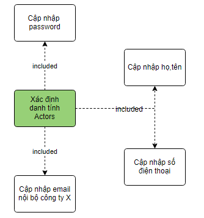 style="width:3.67659in;height:2.69457in" />
>
> Hình 3.7.1 Hệ thống xác định danh tính người dùng
>
> Phân quyền cho người sử dụng đến từng chức năng nhằm bảo vệ thông tin
> người dùng lẫn thông tin dự án:

- Thành viên chỉ có thể tìm và truy cập các dự án được mời.

- Thành viên có thể xem Danh sách thành viên dự án nhưng không được xem
  Thông tin chi tiết của thành viên khác.

> Đảm bảo khả năng backup dữ liệu và phục hồi hệ thống.
>
> Các chính sách bảo mật và quyền riêng tư cần được nêu rõ trong từng dự
> án. Có thể cài đặt mật khẩu cho dự án.

### Tính sẵn sàng và khả năng đáp ứng

> Hệ thống có thể được truy cập bởi bất kỳ máy tính nào có kết nối tới
> Internet.
>
> Hệ thống cho phép tải các dự án về máy tính cá nhân.
>
> Hệ thống hoạt động 24/7

### Giao diện

> Giao diện đơn giản, theo luồng công việc triển khai dự án, hướng tới
> đối tượng không có nhiều kĩ năng công nghệ thông tin.

### Khả năng sử dụng

> Tương tự các phần mềm lưu trữ dự án phổ biến, giúp người dùng dễ hình
> dung mô hình hệ thống, thao tác thuận tiện.
>
> Ngôn ngữ dễ sử dụng, các biểu tượng mang tính nhất quán

### Hiệu suất

> Trang Web tự động cập nhập trạng thái dự án/ thành viên ngay khi quản
> lý xác nhận biểu mẫu.
>
> Bình luận của thành viên được cập nhập liên tục mà không yêu cầu tải
> lại trang Web.
>
> Một số mục tiêu hiệu suất mẫu bao gồm:

- Thời gian phản hồi cho một thao tác trung bình không quá 1s, tối đa
  1s.

- Thời gian tải file \<20MB không quá 2s, các file lớn hơn 20MB cần đổi
  sang đường link liên kết đến bộ nhớ đám mây.

- Có thể cập nhập số lượng nhân viên tối đa là 500 nhân viên/ ngày.

- Có thể cập nhập số lượng dự án tối đa là 50 dự án/ ngày.

### Ràng buộc thiết kế

Hệ thống có khả năng đọc được các ngôn ngữ phần mềm như Python, C++,…

Hệ thống không có ràng buộc về giao diện nhưng cần ưu tiên đơn giản và
tính tương tự các trang quản lý dự án phổ biến như Gitlab.
